# Mermaid 画图

**[点我查看官方文档](https://mermaid-js.github.io/mermaid/#/)**


**mermaid的语法研究**

- 所有代码包裹在``里面
- 需用`mermaid`标识
- 基本构成
  - node(节点)
  - edge(边)
  - text(文本内容)

如

~~~py
	```mermaid
	  这里写代码
    ```
~~~

## simple introduce

一，`节点形状`默认矩形

```
  graph LR
  A-->B
```

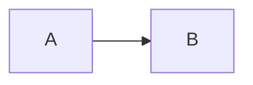

> A,B就是节点

二，`graph [方向]`可设置图形布局方向

**demo1**

```
 graph TB
 A-->B
```

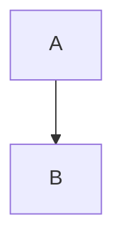


> graph TB 表示 `Top->Bottom`上下布局
>
> graph LR 表示 `Left->Right`左右布局

------

## 1.1. main syntax

### 1.1.1. Shape

- 基本默认形状包括 `矩形`和`圆形`
- 可变体，可嵌套组合
  如
  `[]` 表示矩形,`()` 表示圆弧,`{}` 表示尖角

shape基本形状变体嵌套

一，矩形

```
	graph LR
    id1[This is the text in the box]
 
```

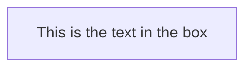

二，圆角矩形

```
	graph LR
    id2(This is the text in the box)
 
```


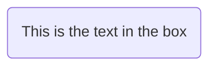

三，圆柱形

```
graph LR
id3[(This is the text in the box)]
 
```

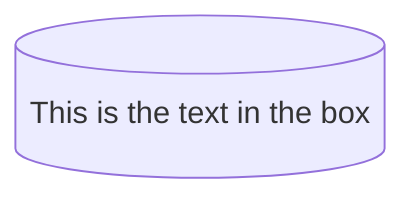

**总结** ： 如何绘制形状

```py
# 格式
id名 形状的标识符号+显示内容
# 实例
id1[i am 矩形] # 矩形
 
id2(i am 圆角矩形) # 圆角矩形
 
id3[(i am  圆柱形)] # 圆柱形
 
id4((i am  正圆 )) #正圆
 
id5> I'm 箭头形矩形] # 箭头形矩形
 
id6{ i am 棱形} #棱形
 
id7{{i am 6边形}}  # 6边形
 
id8[/i am 平行四边形/] # 平行四边形
 
id9[/i am 梯形\] #梯形
 
id10[\i am 另一种梯形/] #另一种梯形
 
```

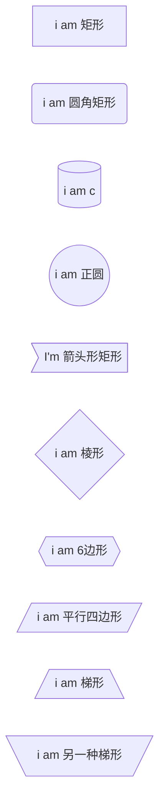

### 1.1.2. node

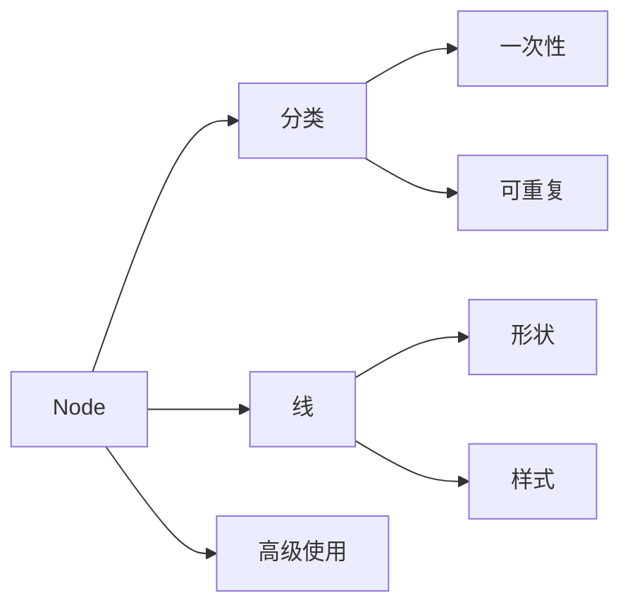


#### 1.1.2.1. 节点分类

- 一次性节点
  - 默认节点形状`矩形`
  - 节点内容即显示为`id`的值

```
graph TD
    id

```

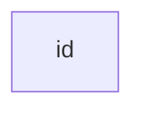

- 非一次性节点(可重复节点)
  - 节点内容非`id`值，可指定形状和内容

```
graph LR
    id1[This is the text in the box]
```


#### 1.1.2.2. 连接线

##### 1.1.2.2.1. 形状

**连接线相关点**

1- 虚实线
2- 箭头样式
3- 连接线描述文字

**一，无描述连接线**

```
graph LR
    A-->B
    C---D
    E------F   //长度可调
    g==>h //加粗
```

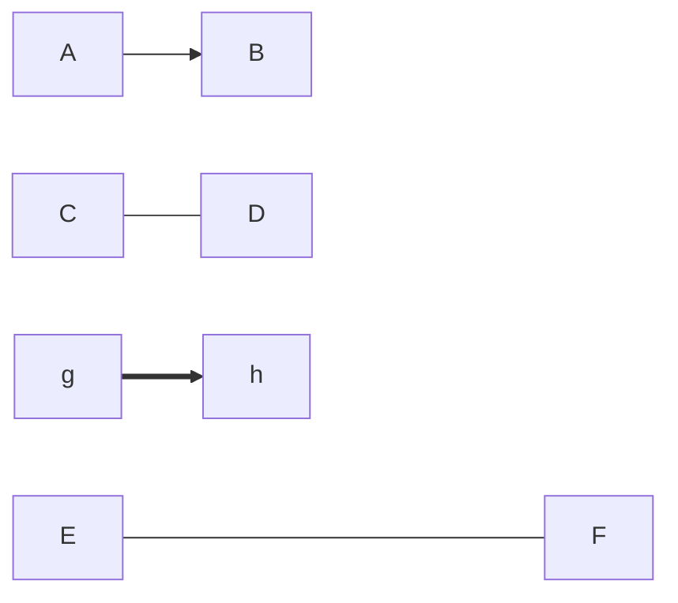

**三，带描述连接线**

```
graph LR
    A--描述-->B
    c--描述---d
    e==text==>f //有描述+有向+加粗
```

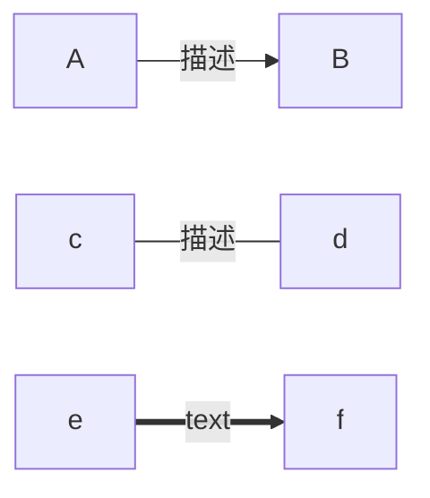

#### 1.1.2.3. 高级用法

**多重连接线**

```
graph LR
   A -- text --> B -- text2 --> C
```

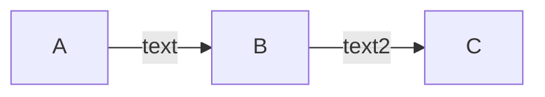

**多节点共同连接**

支持共同连接方式,`A-->B & C` 等价于 `A-->B` 和 `A-->C` 形式

> 可以把`B & C`当为一个整体
>
> A-->(B & C) 即 A-->B 和 A-->C

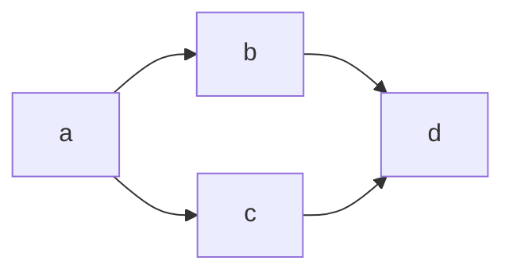

**多节点相互连接**

多节点共同连接的变体形式,`A & B --> C & D` 等价于`A-->C` ,`A-->D`,`B-->C` 和 `B-->D`四种组合形式.

```
graph TB
    A & B--> C & D
```

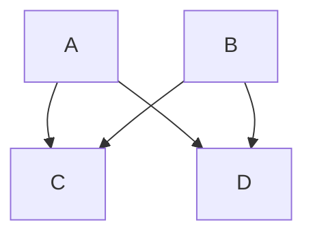

> 可理解为基本数学运算

**双引号包裹特殊字符**

```
graph LR
    id1["This is the (text) in the box"]
```

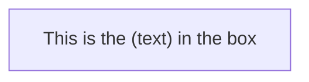

**双引号包裹转义字符**

```
graph LR
    A["A double quote:#quot;"] -->B["A dec char:#9829;"]
```


**注释**

```
graph LR
	%% 这是一个注释语句
	A[我是矩形]
```

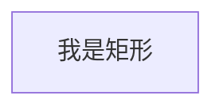

## 1.2. Summary of Basic Usage

关键字

- 英文单词缩写
- 几何化形状
- 有限语法

基础英文单词缩写

| 缩写     | 释义 | 实例                              |
| -------- | ---- | --------------------------------- |
| graph    | 图   | graph `graph`流程图标识符，`必选` |
| subgraph | 子图 | `subgraph`子图标识                |
| 布局     |      |                                   |
| top      | 上   |                                   |
| bottom   | 下   |                                   |
| left     | 左   |                                   |
| right    | 右   |                                   |

### 1.2.1. 形状

#### 1.2.1.1. 基本形状

| 表示符 | 含义     | 类型     |
| :----- | -------- | :------- |
| `[]`   | 矩形     | 节点形状 |
| `()`   | 圆角矩形 |          |
| `{}`   | 菱形     |          |
| `<>`   | 菱形     |          |
| `--`   | 实线     |          |
| `-.`   | 虚线     |          |
| `==`   | 加粗     |          |

#### 1.2.1.2. 几何形状

| 表示符     | 含义     | 类型 |
| ---------- | -------- | ---- |
| `[[]]`     | 正方形   |      |
| `[()]`     | 圆柱体   |      |
| `[{}]`     | 棱柱体   |      |
| `(())`     | 圆形     |      |
| `([])`     | 体育场   |      |
| `({})`     | 圆弧     |      |
| `双大括号` | 六边形   |      |
| `{[]}`     | 正多边形 |      |
| `{()}`     | 圆弧     |      |

官方文档高级探索

[interaciton](https://mermaid-js.github.io/mermaid/#/flowchart?id=interaction)

[styling and classes](https://mermaid-js.github.io/mermaid/#/flowchart?id=interaction)

[Basic support for fontawesome](https://mermaid-js.github.io/mermaid/#/flowchart?id=basic-support-for-fontawesome)

[interval Space](https://mermaid-js.github.io/mermaid/#/flowchart?id=graph-declarations-with-spaces-between-vertices-and-link-and-without-semicolon)

参考 : [关于写作那些事之快速上手Mermaid流程图](https://www.jianshu.com/p/cd1f267784e7)

## 1.3. usage view

### 1.3.1. overview

目前这个 Mermaid 主要可支持的「绘图」有：

- 流图 （Flow）
- 序列图 （Sequence）
- 甘特图（Gantt）
- 类图（Class）
- 状态迁移图（State）
- 饼分图（Pie）

[mermaid官网在线编辑器](https://mermaid-js.github.io/mermaid-live-editor/#/edit/eyJjb2RlIjoic2VxdWVuY2VEaWFncmFtXG4gICAgQWxpY2UtPj4rSm9objogSGVsbG8gSm9obiwgaG93IGFyZSB5b3U_XG4gICAgQWxpY2UtPj4rSm9objogSm9obiwgY2FuIHlvdSBoZWFyIG1lP1xuICAgIEpvaG4tLT4-LUFsaWNlOiBIaSBBbGljZSwgSSBjYW4gaGVhciB5b3UhXG4gICAgSm9obi0tPj4tQWxpY2U6IEkgZmVlbCBncmVhdCFcbiAgICAgICAgICAgICIsIm1lcm1haWQiOnsidGhlbWUiOiJkZWZhdWx0In0sInVwZGF0ZUVkaXRvciI6ZmFsc2V9)

参考 : [Mermaid，就像用 Markdown 码字一样，高效制作简易流图](https://sspai.com/post/63055)

### 1.3.2. 简单流程图

```py
# 格式
id(显示文字) --> id[显示文字]
...
 
# -----------------------------------------------------------------
 
# 实例
 
graph TD
 
A(起床) --> B[洗漱]
 
B --> C{扔硬币}
 
C --正面朝上--> D[喝牛奶]
 
C -->|反面朝上| E[喝果汁]
```

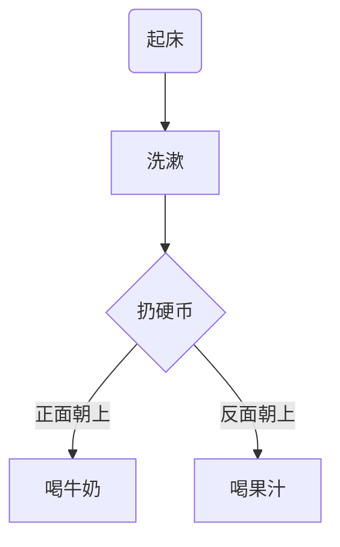

### 1.3.3. 简单序列图

**【案例1】-创建简单时序图**

```py
# 格式
sequenceDiagram # 这是声明一个序列图
[对象1]->>[对象2] : 描述语
[对象2]->>[对象3] : 描述语
# --------------------------------------------------------
# 实例
sequenceDiagram 
 
客户->>银行柜台: 我要存钱  
 
银行柜台->>后台: 改一下这个账户数字哦  
 
后台->>银行柜台: 账户的数字改完了，明天起息  
 
银行柜台->>客户: 好了，给你回单 ，下一位
```

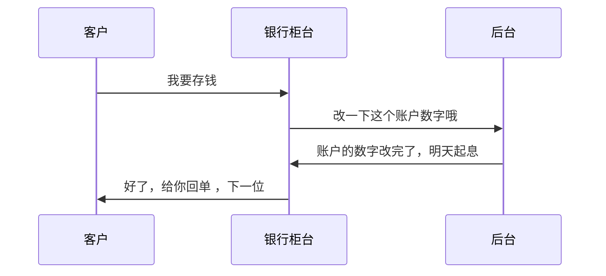

### 1.3.4. 简单甘特图

**【案例1】-gantt图基本使用**

```py
# 格式 
gantt # 声明一个甘特图
title [甘特图标题]
dateFormat [日期格式]
section [部分1名字]
[事件1] : [序列次序标识] , [事件开始时间] ,[持续时间]
section [部分2名字] : [序列次序标识] , [事件开始时间],[持续时间]
 
# 序列次序标识，即事件id
# 如下图的 a1
# after a1 表示 事件的排序，即先后顺序是怎样的，此时是在a1事件的后面，效果如下图，整齐的分隔开
 
# -----------------------------------------------------------------------
 
# 实例
gantt
title A Gantt Diagram
dateFormat YYYY-MM-DD
section Section
A task :a1, 2014-01-01, 30d
Another task :after a1 , 20d
section Another
Task in sec :2014-01-12 , 12d
another task : 24d
```

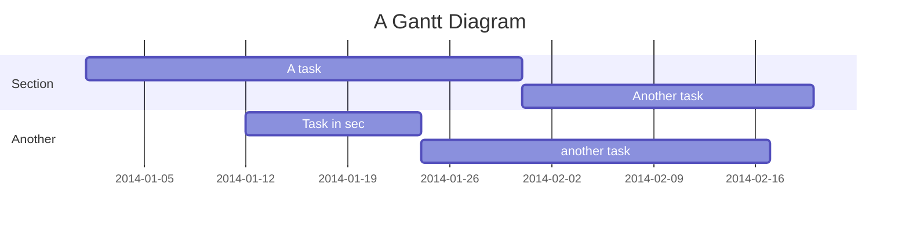

**【案例2】-甘特图事件状态**

```py
# 状态states说明
done # 表示事件完成功
active # 表示事件在活跃，即进行中
crit # 即 critical 紧急事件
# --------------------------------------------------------------
gantt
dateFormat YYYY-MM-DD
title Adding FANTT diagram functionality to mermaid
section A section
Completed task :done, des1, 2014-01-06,2014-01-08
Active task :active, des2, 2014-01-09, 3d
Future task : des3, after des2, 5d
Future task2 : des4, after des3, 5d
section Critical tasks
Completed task in the critical line :crit, done, 2014-01-06,24h
Implement parser and jison :crit, done, after des1, 2d
Create tests for parser :crit, active, 3d
Future task in critical line :crit, 5d
Create tests for renderer :2d
Add to mermaid :1d
section Documentation
Describe gantt syntax :active, a1, after des1, 3d
Add gantt diagram to demo page :after a1 , 20h
Add another diagram to demo page:doc1, after a1 , 48h
section Last section
Describe gantt syntax :after doc1, 3d
Add gantt diagram to demo page :20h
Add another diagram to demo page:48h
```

```mermaid
gantt
dateFormat YYYY-MM-DD
title Adding FANTT diagram functionality to mermaid
section A section
Completed task :done, des1, 2014-01-06,2014-01-08
Active task :active, des2, 2014-01-09, 3d
Future task : des3, after des2, 5d
Future task2 : des4, after des3, 5d
section Critical tasks
Completed task in the critical line :crit, done, 2014-01-06,24h
Implement parser and jison :crit, done, after des1, 2d
Create tests for parser :crit, active, 3d
Future task in critical line :crit, 5d
Create tests for renderer :2d
Add to mermaid :1d
section Documentation
Describe gantt syntax :active, a1, after des1, 3d
Add gantt diagram to demo page :after a1 , 20h
Add another diagram to demo page:doc1, after a1 , 48h
section Last section
Describe gantt syntax :after doc1, 3d
Add gantt diagram to demo page :20h
Add another diagram to demo page:48h
```

### 1.3.5. 简单饼图

```perl
 # 语法
 pie  # 声明 是个饼图
 title  标题
 "分类1" : 所占比例数
 "分类2" : 所占比例数
 "分类3" : 所占比例数
 # -----------------------------------------------------
 # 实例
 pie 
 title My skills
 "Java" : 10
 "JavaScript" :10
 "Python" : 10
 "C/C++" : 3
 "Web font-end" : 10
 
```

```mermaid
 pie 
 title My skills
 "Java" : 10
 "JavaScript" :10
 "Python" : 10
 "C/C++" : 3
 "Web font-end" : 10
```

