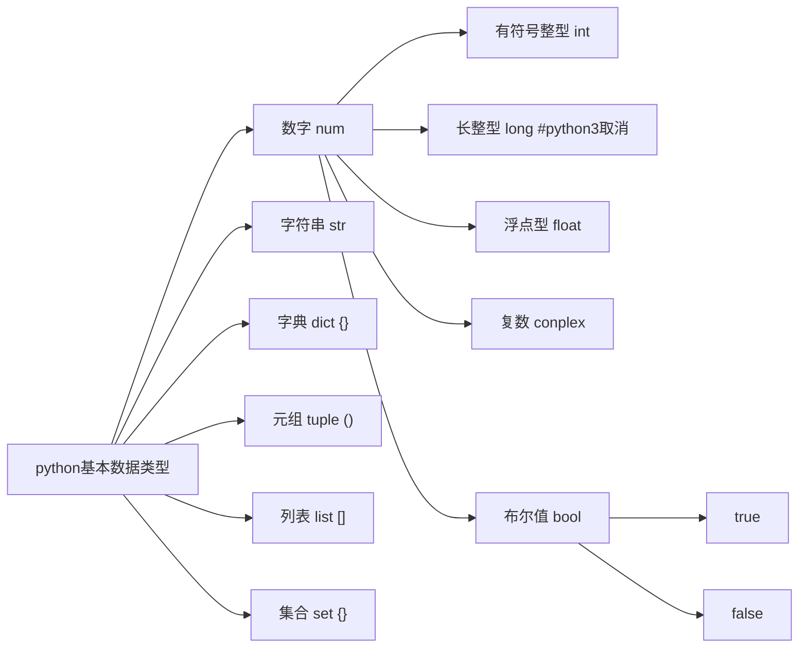
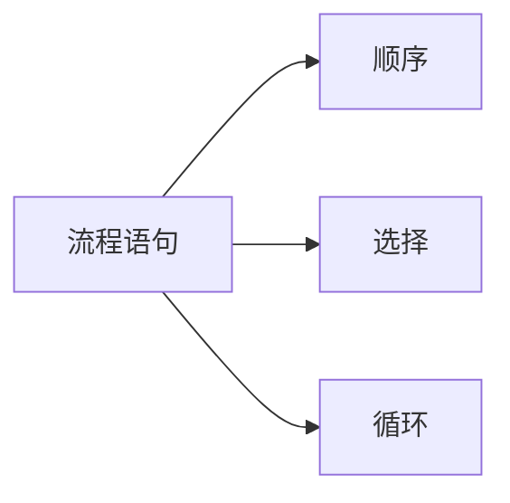
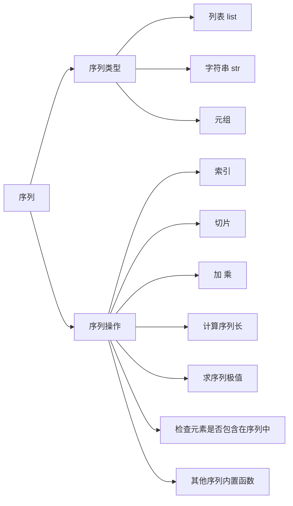
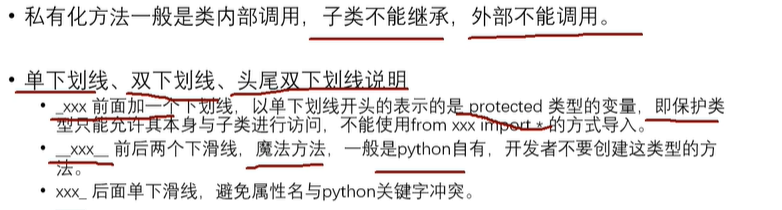

python学习笔记

[toc]

## 注释

##### 1、多行注释

```
方式1：
'''
多行注释内容
'''

方式2
"""
多行注释内容
"""
```

##### 2、特殊注释

```
Linux下起作用,放在文件行首的两个特殊注释
#!/usr1/bin/python3          #指示python解释器的路径
#--coding=utf-8--            #指定编码格式，python3之后默认utf-8可以不用写           
```

#### 变量

1、变量类型



集合与字典不同

```
jihe = {1,2,3,4,5}
#与字典看上去类似，但是是不一样的。字典是 dict1 = {key:value,key2:value2,}需要key
```

（1）集合自动去重

（2）集合打印内容无序， 因为无序，所以不支持切片和索引

集合方法：https://www.runoob.com/python3/python3-set.html#setmethod

2、查看变量类型

```
type(变量名)
isinstance(变量名, 类型名) #isinstance() 函数来判断一个对象是否是一个已知的类型，类似 type()。
```

3、变量命名 （不能使用关键字）

```
>>> import keyword
>>> keyword.kwlist
['False', 'None', 'True', 'and', 'as', 'assert', 'async', 'await', 'break', 'class', 'continue', 'def', 'del', 'elif', 'else', 'except', 'finally', 'for', 'from', 'global', 'if', 'import', 'in', 'is', 'lambda', 'nonlocal', 'not', 'or', 'pass', 'raise', 'return', 'try', 'while', 'with', 'yield']
```

4、变量赋值

```
a,b,c,d = 11,34,654,6 #多个变量可以同时赋值
```

5. 可变数据类型与不可变数据类型

   参考https://www.cnblogs.com/operationhome/p/9642460.html

   | **数据类型** | **可变/不可变** |
   | ------------ | --------------- |
   | 整型         | 不可变          |
   | 字符串       | 不可变          |
   | 元组         | 不可变          |
   | 列表         | 可变            |
   | 集合         | 可变            |
   | 字典         | 可变            |


#### 运算符

1、算数运算符

```
#指数运算**
# #相除取整
# /相除
>>> a=2
>>> b=3
>>> a#b
0
>>> a**b
8
>>> a/b
0.6666666666666666
```

2、比较运算符

```
#下面6个运算符与c语言相同
== != < > <= >=
```

3、逻辑运算符

```
and or not
# 优先级比较 () -> not -> and -> or
```

 4、赋值运算

```
# **=
# #=
```

#### 输入输出

1、格式化输出，占位符%, print自带换行 ，可以通过end参数指定行尾符号

```
print('我的名字是%s：来自【%s】' % (name, class))
print(f"{name}", end="!") #叹号结尾
```

2、常用格式化符号

format可以实现非常灵活的格式化输出

参考：[python基础_格式化输出（%用法和format用法）](https:#w ww.cnblogs.com/qinchao0317/p/10699717.html)

3、输入 input()

注意，输入的都是str类型

```
name = input('please input your name：')
```

#### 流程语句



1、条件语句

- elif相当于C语言中的else if
- 条件表达式：比较运算符、逻辑运算符、复合运算符
- 跳出if到下个分支处理的方法：1、下一行定格写 2、使用pass空语句，表示该代码块结束

#### 循环语句

1、两种循环

- while主要用在不确定循环次数的场景
  while 条件表达式：

  ​    	循环体

- for主要用于遍历
  for ... in 可迭代的对象(字符串，列表等)

  ​		循环体

2、for循环中用到的list与range

```
#range用法，python3中range返回的可迭代对象（类型是对象），而不是列表，range与list切片访问明确的边界都是左闭右开
range(start, stop[, step])

>>> type(range(1,2,1))
<class 'range'>
```

3、for...else... 与 while...else..

有时我们需要判断程序是正常退出循环（遍历完成），还是中途退出，据此来进行下面的不同操作。可能会加一个判断，比如下面的代码：

```
a = [1, 2, 3, 4]
flag = True
for i in range(len(a)):
	if a[i] == 2:
		flag = False
		break
if flag:
	print('yes')
else:
	print('no')
```


用for … else 可以简化

```
a = [1, 2, 3, 4]
for i in range(len(a)):
	if a[i] == 2:
		break
else:
	print('yes')
print('no')
```

正常退出循环会执行else，使用break提前退出会跳过else

4. iterable可迭代

简单说就是可以进行`for`循环的。
字符串、list类型、字典类型、元组类型，包括自定义的类都是可以迭代。

## 序列

1. 总览



2.  序列的切片操作（以list为例）

- 可以使用索引访问列表内容。序列中的索引编号，都是从0开始递增

```
numbers=[1,2,3,4,5,6]
numbers[0]        	#输出1
numbers[-1]			#输出6
```

- 使用切片进行访问

```
numbers=[1,2,3,4,5,6,7,8,9,10]
numbers[:]				#[1,2,3,4,5,6,7,8,9,10]取整个列表
numbers[1:4]            #[2,3,4]
numbers[0:1]            #[1]
numbers[7:10]           #[8,9,10]
numbers[7:]             #[8,9,10]
numbers[:3]             #[1,2,3]
numbers[-3:]            #[8,9,10]
numbers[-3:-1]          #[8,9] 没有倒数第0，表示从倒数第三个到倒数第一个
```

切片提供了两个索引来指定切片大的边界，第一个索引指定开始位置（包含在切片内），第二个索引指定的结束的位置，不包含在切片内。如果索引是负数，是从切片末尾进行，负数的索引不能获取列表中最后一个元素。比如numbers[-2:-1]这是倒数第二个元素，numbers[-1:0]这是一个空列表。

- 使用切片，指定步长，默认是1

  `[start：end：step]`

```
numbers=[1,2,3,4,5,6,7,8,9,10]
numbers[::1]            #[1,2,3,4,5,6,7,8,9,10]
numbers[2::2]           #[3,5,7,9]
numbers[2::-1]          #[3,2,1]
```

第三个参数用于指定步长，如果是负数，即从右向左提取元素。numbers[2:4:-1] 是[]，步长是负数，从索引2的位置开始，向左到索引位置为4的位置，显然不存在，结果为[]。numbers[4:2:-1]，从索引位置4开始，向左到索引位置为2的地方，第一个索引包含在列表中，结果[5,4]。

- 可以使用切片方式，实现序列反转,字符串反转。

```
str="nihao"
str[::-1]        #'oahin'
```

3. 序列加乘

```
str="c.biancheng.net"
print("C语言"+"中文网:"+str)  #C语言中文网：c.biancheng.net
str="C语言中文网"
print(str*3)				#C语言中文网C语言中文网C语言中文网
```

4. 检查元素是否包含在序列中

```
str="c.biancheng.net"
print('c'in str) 		#True
print('c' not in str)	#False
```

5. 内置函数

| 函数        | 功能                                                         |
| ----------- | ------------------------------------------------------------ |
| len()       | 计算序列的长度，即返回序列中包含多少个元素。                 |
| max()       | 找出序列中的最大元素。注意，对序列使用 sum() 函数时，做加和操作的必须都是数字，不能是字符或字符串，否则该函数将抛出异常，因为解释器无法判定是要做连接操作（+ 运算符可以连接两个序列），还是做加和操作。 |
| min()       | 找出序列中的最小元素。                                       |
| list()      | 将序列转换为列表。                                           |
| str()       | 将序列转换为字符串。                                         |
| sum()       | 计算元素和。                                                 |
| sorted()    | 对元素进行排序。                                             |
| reversed()  | 反向序列中的元素。                                           |
| enumerate() | 将序列组合为一个索引序列，多用在 for 循环中。                |

### 字符串

1. python转义字符（不熟悉的）

   | 转义字符     | 描述   |
   | :----------- | :----- |
   | \\(在行尾时) | 续行符 |
   | \oyy | 八进制数，y 代表 0~7 的字符，例如：\012 代表换行。|
   | \xyy | 十六进制数，以 \x 开头，yy代表的字符，例如：\x0a代表换行 |

2. 字符串运算符

   下表实例变量 a 值为字符串 "Hello"，b 变量值为 "Python"：

| 操作符 | 描述                                                         | 实例                                 |
| :----- | :----------------------------------------------------------- | :----------------------------------- |
| +      | 字符串连接                                                   | >>>a + b 'HelloPython'               |
| *      | 重复输出字符串                                               | >>>a * 2 'HelloHello'                |
| []     | 通过索引获取字符串中字符                                     | >>>a[1] 'e'                          |
| [ : ]  | 截取字符串中的一部分                                         | >>>a[1:4] 'ell'                      |
| in     | 成员运算符 - 如果字符串中包含给定的字符返回 True             | >>>"H" in a True                     |
| not in | 成员运算符 - 如果字符串中不包含给定的字符返回 True           | >>>"M" not in a True                 |
| r/R    | 原始字符串 - 原始字符串：所有的字符串都是直接按照字面的意思来使用，没有转义特殊或不能打印的字符。 原始字符串除在字符串的第一个引号前加上字母"r"（可以大小写）以外，与普通字符串有着几乎完全相同的语法。 | >>>print r'\n' \n >>> print R'\n' \n |
| %      | 格式字符串                                                   | 请看下一章节                         |

3. python 字符串格式化符号:

| 符  号 | 描述                                 |
| :----- | :----------------------------------- |
| %c     | 格式化字符及其ASCII码                |
| %s     | 格式化字符串                         |
| %d     | 格式化整数                           |
| %u     | 格式化无符号整型                     |
| %o     | 格式化无符号八进制数                 |
| %x     | 格式化无符号十六进制数               |
| %X     | 格式化无符号十六进制数（大写）       |
| %f     | 格式化浮点数字，可指定小数点后的精度 |
| %e     | 用科学计数法格式化浮点数             |
| %E     | 作用同%e，用科学计数法格式化浮点数   |
| %g     | %f和%e的简写                         |
| %G     | %F 和 %E 的简写                      |
| %p     | 用十六进制数格式化变量的地址         |

4. 格式化操作符辅助指令:

| 符号  | 功能                                                         |
| :---- | :----------------------------------------------------------- |
| *     | 定义宽度或者小数点精度                                       |
| -     | 用做左对齐                                                   |
| +     | 在正数前面显示加号( + )                                      |
| <sp>  | 在正数前面显示空格                                           |
| #     | 在八进制数前面显示零('0')，在十六进制前面显示'0x'或者'0X'(取决于用的是'x'还是'X') |
| 0     | 显示的数字前面填充'0'而不是默认的空格                        |
| %     | '%%'输出一个单一的'%'                                        |
| (var) | 映射变量(字典参数)                                           |
| m.n.  | m 是显示的最小总宽度,n 是小数点后的位数(如果可用的话)        |

Python2.6 开始，新增了一种格式化字符串的函数 [str.format()](https://www.runoob.com/python/att-string-format.html)，它增强了字符串格式化的功能。

5. [Python 输出字符串左对齐、右对齐、居中对齐](https://blog.csdn.net/beautiful77moon/article/details/88874541)

- 通过ljust(),center(),rjust()函数实现
- 通过format()函数格式化实现

6. python三引号

   python三引号允许一个字符串跨多行，字符串中可以包含换行符、制表符以及其他特殊字符。

   ```
   #!/usr/bin/python3
    
   para_str = """这是一个多行字符串的实例
   多行字符串可以使用制表符
   TAB ( \t )。
   也可以使用换行符 [ \n ]。
   """
   print (para_str)
   ```

   ```
   这是一个多行字符串的实例
   多行字符串可以使用制表符
   TAB (    )。
   也可以使用换行符 [ 
    ]。
   ```

7. f-string

   f-string 是 python3.6 之后版本添加的，称之为字面量格式化字符串，是新的格式化字符串的语法。

   **f-string** 格式化字符串以 **f** 开头，后面跟着字符串，字符串中的表达式用大括号 {} 包起来，它会将变量或表达式计算后的值替换进去，实例如下：

   ```
   >>> name = 'Runoob'
   >>> 'Hello %s' % name
   'Hello Runoob'
   >>> f'Hello {name}'  # 替换变量
   'Hello Runoob'
   >>> f'{1+2}'         # 使用表达式
   '3'
   >>> w = {'name': 'Runoob', 'url': 'www.runoob.com'}
   >>> f'{w["name"]}: {w["url"]}'
   'Runoob: www.runoob.com'
   ```

   在 Python 3.8 的版本中可以使用 **=** 符号来拼接运算表达式与结果：

   ```
   >>> x = 1
   >>> print(f'{x+1=}')   # Python 3.8
   'x+1=2'
   ```

8. 字符串前缀u，b，r，f用法

   在Python2中，普通字符串是以8位ASCII码进行存储的，而Unicode字符串则存储为16位unicode字符串，这样能够表示更多的字符集。使用的语法是在字符串前面加上前缀 **u**。

   - u
     表示unicode，以unicode编码存储，能够储存中文。python3中默认以unicode编码储存字符串

   - b
     以Ascll码形式储存字符串，无法储存中文

   - r
     表示raw string，不识别转义。
     例：

     ```python
     print(r"name:\n赵四")
     ****************************
     运行结果：
     name:\n赵四
     ```

   - f
     表示format，用来格式化字符串。
     例：

     ```
     name = '赵四'
     age = 44
     print(f'name:{name}\nage:{age}')
     ********************************************
     运行结果：
     name:赵四
     age:44
     ```

9. 其他内建函数

10. 字符串赋值

    ```
    a = '  hello world!    '
    print(a.strip())
    print(a.lstrip())
    print(a.rstrip())
    c = 1
    d = c #c和d实际是对同一个地址的引用, 如果b再被赋值其他值，那么就会为d分配不同的地址
    print('c的内存地址%d'% id(c))
    print('d的内存地址%d'% id(d))
    d = 2
    print('c的内存地址%d'% id(c))
    print('d的内存地址%d'% id(d))
    print(f'{c=}')
    ```

    ```
    hello world!
    hello world!    
      hello world!
    c的内存地址140724417992352
    d的内存地址140724417992352
    c的内存地址140724417992352
    d的内存地址140724417992384
    c=1
    ```

11. 转义字符串与不转义的字符串相互转化

    如下，通过print()打印出来的不再为转义字符串

    ```
    >>> import matplotlib
    >>> matplotlib.__file__
    'D:\\Program Files\\python38\\lib\\site-packages\\matplotlib\\__init__.py'
    >>> print(matplotlib.__file__)
    D:\Program Files\python38\lib\site-packages\matplotlib\__init__.py
    
    >>> print(r'\n\n\n') #不转义字符串变为转义字符串
    \n\n\n
    >>> r'\n\n\n'
    '\\n\\n\\n'
    ```

12. u'string'、r'string'、f-string

    1）字符串前加 u = unicode编码，后面字符串以 Unicode 格式 进行编码，一般用在中文字符串前面，防止因为源码储存格式问题，导致再次使用时出现乱码。

    2）字符串前加 r = raw 原始输入，声明后面的字符串是普通字符串。

    3）f-string，亦称为格式化字符串常量（formatted string literals）。f-string在形式上是以 `f` 或 `F` 修饰符引领的字符串（`f'xxx'` 或 `F'xxx'`），以大括号 `{}` 标明被替换的字段；f-string在本质上并不是字符串常量，而是一个在运行时运算求值的表达式。与其功能相同的还有[%-formatting语句](https://docs.python.org/3/library/stdtypes.html#old-string-formatting)和[`str.format()`函数](https://docs.python.org/3/library/stdtypes.html#str.format)

    

### list 列表 []

1. 列表中数据可以是任意类型，类型可以混合

2. range() 与list的区别

   - range()是依次取顺序的数值，一般是用来进行循环迭代用的

   - list是一个列表，里面可以存各种类型

   - range可以强转为list类型

   ```
   >>> print(type(range(10)))
   <class 'range'>
   >>> print(type(list()))
   <class 'list'>
   ```

   range(10)相当与range(0,10)

   range(0,10,2)  最后一个参数是步长

   

##### tuple 元组 () 

1. 是一种不可变序列，创建后不能做任何修改，只能查询，或者重新给元组赋值

   ```
   tupleA = ()
   print(id(tupleA))
   tupleA = ('dsaf',4 ,124.3, (1,3,6,'dzh'))
   print(id(tupleA))
   ```

   ```
   2323863699520
   2323864166464
   ```

   可以看到重新赋值后，地址变了，因为元组一旦创建后不能改变，类似c语言常量字符串。

   ```
   tupleA = ('dsaf',4 ,124.3, [1,3,6,'dzh'])
   tupleA[3][1] = 666;
   print('tupleA中嵌套的列表是可以修改的：', tupleA)
   ```

   ```
   tupleA中嵌套的列表是可以修改的： ('dsaf', 4, 124.3, [1, 666, 6, 'dzh'])
   ```

   元组中嵌套的列表是可以修改的

2. 数据项可以是任何的数据类型

3. 只有一个数据时，需要写一个逗号，不然会认为是整型

   ```
   tupleB = ('peter',)
   print('元组只包含一个元素，最后需要一个逗号，否则不能识别为元组:',tupleB)
   tupleB = ('peter')
   print(tupleB)
   print(type(('peter',)))
   print(type(('peter')))
   ```

   ```
   元组只包含一个元素，最后需要一个逗号，否则不能识别为元组: ('peter',)
   peter
   <class 'tuple'>
   <class 'str'>
   ```

   

4. range也可以强转为元组和集合

   

##### 字典

1. 不属于序列，没有下标概念，无序键值对集合

2. {}来表示字典对象，每个键值对通过逗号分开。
3. 通过key访问，key不能重复
4. key不能修改，必须是不可变的类型（元组，字符串等），值可以是任意类型

##### 函数

参数、返回值、嵌套调用

调用函数前必须先定义

1. 参数

   传参、调用、不定长参数、缺省参数
   
   参数类型： 必选参数、默认参数[缺省参数]、可选参数、关键字参数
   
   **缺省参数必须要在参数列表的尾部**
   
   **可变参数传递进函数后是一个不能修改的元组**
   
   **可变关键字参数传递进函数后是一个字典**
   
   **函数定义中可变参数必须放在可变关键字参数之前**
   
2. 函数的备注信息

   使用三引号放在函数内部开始

   在pycharm中ctrl键+鼠标停留在函数上，就会显示出函数的备注信息

```
def printInfo():
    '''
    这里写函数的备注信息
    :return: 
    '''
    print('dzh的身高是%.2f' % 1.73)
    print('dzh的体重是%.f' % 160)
    pass
```
下面是备注显示的信息，可以看到`备注`信息，函数的`返回值`是None
```
def printInfo() -> None
这里写函数的备注信息
```

3. 关键字参数

   使用** 来定义

   在函数体内参数关键字是一个`字典类型`，key必须是字符串

   关键字参数可以直接指定实参传递给那个参数，那么就不需要关注变量的顺序。可以传递不定数量的键值对

    参考：http://c.biancheng.net/view/2250.html

```
def complexFunc(*args, **kwargs):
    print(args)
    print(kwargs)
    pass

complexFunc()
complexFunc(1,2,3,4)
# name ='dzh',age=27  传递进入函数后是以字典的形式体现
complexFunc(1,2,3,4,name ='dzh',age=27)
```

```
()
{}
(1, 2, 3, 4)
{}
(1, 2, 3, 4)
{'name': 'dzh', 'age': 27}
```

4. 函数分类

   有参数无返回值

   有参数有返回值

   无参数无返回值

   无参数有返回值

5. 函数内部修改全局变量

   要使用global关键字进行声明

   ```
   globalVar = '我是全局变量'
   print('全局变量修改前：', globalVar)
   def updataGlobalVar():
       global globalVar
       globalVar = '更新了全局变量'
   updataGlobalVar()
   print('全局变量修改后：', globalVar)
   ```

   ```
   全局变量修改前： 我是全局变量
   全局变量修改后： 更新了全局变量
   ```

   

6. python中的传参是引用传参不是值传参

   参考 [Python中的引用传参](https://www.cnblogs.com/yxtz271828/p/8988176.html)

   多种传参方式的对比：[值传参，值的引用传参，指针传参（两类），指针的引用传参（两类）](https://blog.csdn.net/qq_38850266/article/details/94058139)

7. 匿名函数 lambda

   语法：

   ​		lambda 参数1，参数2... ：表达式

   特点：

   ​		使用lambda关键字创建；没有名字；匿名函数冒号后的表达式有且只有一个，是表达式不是语句；自带return，且返回的结果就是表表达式的值。

   缺点：

   ​		lambda缺点：只能是单个表达式，不是一个代码块，设计的目的是为了满足简单函数的场景，仅能封装有限逻辑，复杂逻辑要用def处理

   

   - 三元运算代替if else双分支操作  b if a else c

     lambda表达式结合三元表达式应用

   ```
   age = 25
   print('可以参军' if age > 18 else '继续上学')
   
   funcTest = lambda age :'可以参军' if age > 18 else '继续上学'
   print(funcTest(15))
   ```

   ```
   可以参军
   继续上学
   ```

   

8. 序列的内建函数 sort与sorted的区别

   sort()方法是list的内置函数，只能用于列表，sort直接修改原始列表的内容；

   sorted()方法用于可迭代的序列，会返回一个排好序的新的序列。

9. 函数语法中参数用中括号（[]）和逗号（,）嵌套表示是何种含义？

   - [, a[, b]]：嵌套形式表示 b 是独立于 a 的可选参数，即在传入 a 的情况下，b 可以自由地选择传入或省略。
   - [, a, b] ：扁平形式表示 a 与 b 合在一起是一组可选参数，即 a 和 b 必须同时传入或者同时省略，但不能只传入一个

10. python内置函数分类

    数学运算

    类型转换

    序列操作

    集合操作


## python函数

### 字符串 

#### rsplit() 

作用：rsplit() 方法从右侧开始将字符串拆分为列表

语法：`string.rsplit(separator, max)`

> *separator*  可选。规定分割字符串时要使用的分隔符。默认值为空白。     
>
> *max*        可选。指定要执行的拆分数。默认值为 -1，即“所有出现次数”。 

eg:

```
txt = "apple, banana, cherry"
x = txt.rsplit(", ", 1)
print(x)
```

结果为：['apple, banana', 'cherry']

## python数据画图

### 相关模块

- Pyecharts
- Matplotlib [官网](https://matplotlib.org/3.2.2/tutorials/introductory/sample_plots.html)

### Pyecharts

### Matplotlib

#### 例1

```
import matplotlib.pyplot as plt

a = [51,226,208,165,202,286,190,212,219,271,36]
plt.plot(a,a*1.5,a,a*2.5,a,a*3.5,a,a*4.5)
plt.show()
```

#### 例2


## 面向对象

### 背景介绍

#### 概念

面向对象编程：oop[object oriended programming]，关注设计思维

面向过程编程：按照解决问题的步骤去写代码，根据业务逻辑去写代码

#### 两种编程模式对比

面向对象更适合大型项目

面向过程关注怎么做？面向对象关注谁来做？

面向过程

优点：性能比面向对象高，因为类调用时需要实例化，开销比较大，比较消耗资源;比如单片机、嵌入式开发、 Linux/Unix等一般采用面向过程开发，性能是最重要的因素。
缺点：没有面向对象易维护、易复用、易扩展

面向对象

优点：易维护、易复用、易扩展，由于面向对象有封装、继承、多态性的特性，可以设计出低耦合的系统，使系统 更加灵活、更加易于维护
缺点：性能比面向过程低

#### 类和对象

类是从实际场景中理想抽象的模板，现实世界行为抽到到方法，特征抽象为属性

对象就是通过模板产生的一个实例

### 类

#### 概念

类名、属性、行为

创建类的时候实际上，没有在内存中创建任何空间，当实例化一个对象的时候，会在内存中创建一个对象空间

#### 实例方法

在类的内部，使用def关键字可以定义一个实例方法，与一般函数定义不同，类的方法必须包含参数self，且为第一个参数

#### 类属性

定义在类中的变量

#### 实例属性

类似实例方法，在方法内部定义的，并且通过类似self.变量名 的形式定义的变量

#### 魔术方法

双下划线开始和结尾的方法，python中已经内置好的类的方法

方法名"\_\_XXX\_\_"

##### ____init____方法

初始化的方法，定义实例属性和初始化实例属性

实例化对象的时候自动调用，完成 一些初始化设置

利用传参机制可以方便的实例化一个对象，不用专，门为一个实例手动添加属性

##### self

self和对象指向同一个内存地址，可以认为self是对象的引用，可以理解为对象自己，对谋个对象调用其方法时，python解释器会把这个对象作为第一个参数传递给函数，所以开发者只需要传递后面的参数即可

只有在类中定义实例方法的时候才有意义，在调用时不必手动传递（但是要用变量来接受），解释器会自动传递

名字不一定叫self，也可以叫其他，不过约定俗成是self，相当于java中的this

每个实例函数的第一个参数都是用来接受self对象自己，名字也可以不统一

##### ____new____与____init____区别

    __new__ 
    类的实例化方法，必须要返回该实例，否则对象创建失败
    至少有一个参数是cls，代表要实例化的类，此参数在实例化的时由python解释器自动传递
    函数执行new在前，init在后
    __init__
    用来做数据属性的初始化工作，也可以认为是该实例的构造方法，接受类的实例self，并对其进行构造

#### 多继承

一个子类可以同时继承多个父类。

类的传递过程中，父类又叫基类，子类又叫派生类，父类的方法可以一级一级的传递给子类。多少级都可以传递。一般情况建议不超过三级

#### 重写方法

子类中有同名方法，子类的可以覆盖父类的，覆盖的顺序实际上与继承的顺序是对应的

父类的方法无法满足子类的需要，那么子类就可以重写父类的方法，或者晚上父类的方法

子类中调用父类方法可以使用父类名手动调用，也可以使用super() 方法自动的去找父类的方法，如果有多个父类，就逐个去找，知道找到为止；


#### 私有化方法



前面加双下划线表示私有方法或者私有属性（私有实例属性、私有类属性）


## Python库的手动安装

### pip源配置

#### windows配置

在用户目录下有个pip.ini文件（没有就创建），参考如下配置：

```
[global]
index-url = https://mirrors.aliyun.com/pypi/simple
[install]
trusted-host=mirrors.aliyun.com/pypi
[list]
format=columns
```

> 默认配置的是国外的Python官方库，因为国内连接国外的网络比较慢，因此一般都要先将它配置为国内的地址

-  [global]表示所有的模块都使用这个地址来下载

-  [install]表示使用信任这个地址

-  [list]表示模块输出信息的格式

#### Linux配置

#### pip源

1、查找软件

```shell
pip search Package
```

2、安装软件

```shell
pip install Package
pip install -r requirements.txt
```

3、更新软件

```shell
pip install -U Package
```

4、卸载软件

```shell
pip uninstall Package
```

5、列出已安装软件

```shell
pip list
pip freeze
pip freeze -r requirements.txt
```

6、查看一个软件包安装了哪些文件

```shell
pip show -f Package
```

7、升级所有包

```shell
for i in `pip3 list --outdated --trusted-host pypi.douban.com | tail -n +3 | awk '{print $1}'`; do pip3 install -U $i; done
```

8、pip安装源查看、修改、升级

```shell
# 查看
pip config list

# 修改源
pip3 config set global.index-url = http://mirrors.aliyun.com/pypi/simple/
pip3 config set global.trusted-host = mirrors.aliyun.com

# pip 升级
pip3 install --upgrade pip 
```

9、pip常用源

```
阿里云http://mirrors.aliyun.com/pypi/simple/
清华大学https://pypi.tuna.tsinghua.edu.cn/simple/
中国科技大学https://pypi.mirrors.ustc.edu.cn/simple/
中国科学技术大学http://pypi.mirrors.ustc.edu.cn/simple/
豆瓣https://pypi.douban.com/simple/
```

10、pip临时用其他源下载

```
在pip命令后加上-i参数，并制定源地址。
如安装scrapy：
pip install scrapy -i https://pypi.tuna.tsinghua.edu.cn/simple
```

### 命令行安装python模块

#### 安装命令

`pip install module_name`

> 注意要在window的命令行下安装，而不是在python的命令行
>
> 实际会安装到lib目录，如：*D:\Program Files\python38\Lib\site-packages*

### 查看本地python类库详细信息

1. 配置了python的环境变量

2. 在命令行输入： `python -m pydoc -p 1234`

   >python -m pydoc 表示打开pydoc模块，该模块用于查python文档
   >
   >-p 1234 表示在端口号1234上打开server，端口号可自行设置

3. 浏览器打开： 127.0.0.1：1234就可以看到文档目录

4. 也可以在python命令行通过如下方式找到模块的安装位置

   ```
   >>> import matplotlib
   >>> matplotlib.__file__
   'D:\\Program Files\\python38\\lib\\site-packages\\matplotlib\\__init__.py'
   ```


### 第三方库安装

#### 查看某个包的前置依赖

`pip show requests`  可以查看安装requests之前需要安装哪些包

#### 自动安装缺少的包

我写个Python脚本给别人用，但是脚本中包含了一个第三方库，别人执行的时候就会提示缺少，能否让Python自动安装？答案是肯定的。

在引用出插入如下代码：

```
try:
	import requests
except:
	import os
	os.system('pip install requests')
	import requests
```

#### 手动安装

以requests为例子

通过该链接获取安装包：https://pypi.org/project/requests/#files

两种格式的安装包：

[requests-2.26.0-py2.py3-none-any.whl ](https://files.pythonhosted.org/packages/92/96/144f70b972a9c0eabbd4391ef93ccd49d0f2747f4f6a2a2738e99e5adc65/requests-2.26.0-py2.py3-none-any.whl)

[requests-2.26.0.tar.gz ](https://files.pythonhosted.org/packages/e7/01/3569e0b535fb2e4a6c384bdbed00c55b9d78b5084e0fb7f4d0bf523d7670/requests-2.26.0.tar.gz)

##### tar.gz包的安装

- 解压
- 运行 `python setup.py install` 完成安装

> 这种方式不会自动下载依赖，所以安装过程中遇到缺少依赖文件，需要自行下载安装

##### whl包安装

whl格式本质上是一个压缩包，里面包含了py文件，以及经过编译的pyd文件。使得可以在不具备编译环境的情况下，选择合适自己的python环境进行安装。

- 安装方法很简单 `pip install xxxx.whl`
- 如果是升级则执行 `pip install -U xxxx.whl`