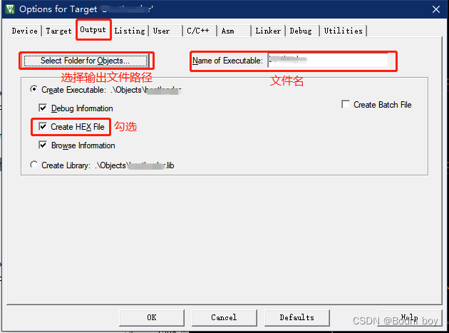
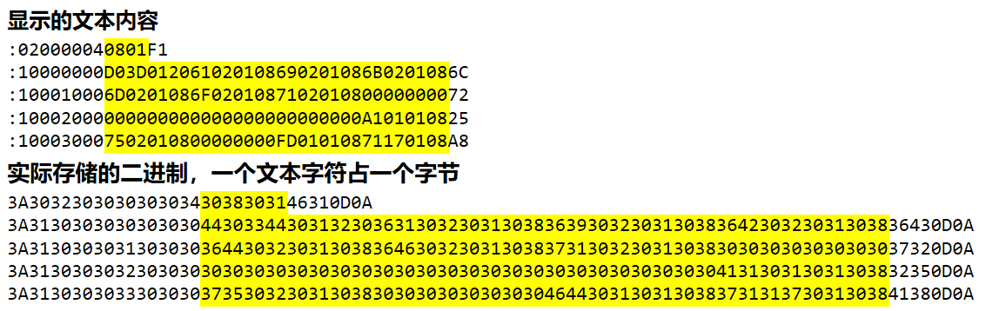
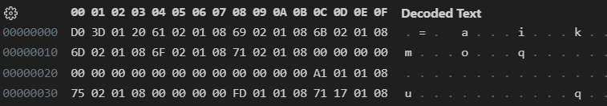

# excel

## 快捷键

隐藏选中的单元格所在的列：ctrl + 0us

隐藏选中的单元格所在的列：ctrl + 9

插入当前日期： ctrl + ；

车擦如单签时间：ctrl + shift + ；

插入时间：Ctrl+;

## 操作技巧

1. 设置正方形表格
   选择所有（或您需要的行/列），然后拖动以调整大小到所需的大小。
   拖动列标题的边缘以调整列宽。出现一个工具提示，其中包含精确的像素数。调整高宽像素值得到标准正方形
2. linux 目录 ~ 和/的区别

   /代表着 bai 根目录；~则代表着用户的家目录，比如当前我使用 root 登录，那么~对于我来说就是/root，而如果我使用 linuxer 这个用户登录，~则代表着/home/linuxer

# linux

清空命令行光标之前的已输入内容： ctrl+u

清空命令行光标之前的已输入内容（遇到空格停止删除）：ctrl+back

命令行快速移动光标（以空格作为停顿点）：ctrl+← 、ctrl+→

在历史命令中搜索：ctrl+r

> Ctrl+R 执行的是 reverse-search-history，通过 Ctrl+R 可以根据关键字搜索历史命令，按多次 Ctrl+R 可以继续搜索更旧的历史命令。

退出当前用户： ctrl+d

命令行当前字符与前一个字符交换位置： ctrl+t

清屏：ctrl+l

# mobaXterm

命令行粘贴： 单击鼠标滚轮键

命令行复制粘贴：双击复制命令行所打印的内容，右键自动粘贴到光标处

# typora

> 参考链接：https://support.typora.io/Shortcut-Keys/

## 编辑快捷键

复制为 MarkDown：Ctrl+Shift+C

粘贴为纯文本：Ctrl+Shift+V

全选：Ctrl+A

选中当前行/句：Ctrl+L

选中相同格式的文字：Ctrl+E

选中当前词：Ctrl+D

跳转到文首：Ctrl+Home

跳转到所选内容：Ctrl+J

跳转到文末：Ctrl+End

查找：Ctrl+F 、F3

查找下一个：F3

查找上一个：Shift+F3

替换：Ctrl+H

目录：[TOC]

任务列表：- [ ] 文字 （注意 “-” 后、 “[]“ 中间、“[]“后都有空格）

选中一整行：ctrl+l (字母 L)

粘贴为纯文本： ctrl+shift+v

删除线：alt+shift+5

## 段落快捷键

标题：Ctrl+1/2/3/4/5

段落：Ctrl+0

增大标题级别：Ctrl+=

减少标题级别：Ctrl+-

表格：Ctrl+T

代码块：Ctrl+Shift+K、 ctrl + shift + `

公式块：Ctrl+Shift+M

引用：Ctrl+Shift+Q、输入>之后输入空格

有序列表：Ctrl+Shift+[ 、输入-之后输入空格

无序列表：Ctrl+Shift+]、输入+之后输入空格

增加缩进：Ctrl+]

减少缩进：Ctrl+[

## 格式快捷键

加粗：Ctrl+B

斜体：Ctrl+I

下划线：Ctrl+U

代码：Ctrl+Shift+`

删除线：Alt+Shift+5

超链接：Ctrl+K

图像：Ctrl+Shift+I

清除样式：Ctrl+

## 视图快捷键

显示隐藏侧边栏：Ctrl+Shift+L

大纲视图：Ctrl+Shift+1

文档列表视图：Ctrl+Shift+2

文件树视图：Ctrl+Shift+3

源代码模式：Ctrl+/

专注模式：F8

打字机模式：F9

切换全屏：F11

实际大小：Ctrl+Shift+0

放大：Ctrl+Shift+=

缩小：Ctrl+Shift+-

应用内窗口切换：Ctrl+Tab

打开 DevTools：Shift+F12

## 编辑模式快捷键

源码模式编辑切换：ctrl + /

Typora 内部窗口焦点切换：ctrl + tab

侧边栏显示/隐藏切换：ctrl + shift + L

## 特殊字符输入

输入表情： `:表情:` （如 😄）

# vscode

## 常用快捷键

配置文件： ctrl+shift+p

编译：F5

选中正则匹配的结果：ctrl+shift+l 、alt+enter

折叠所有代码：ctrl+k+0

展开所有代码： ctrl+k+j

- 折叠某个函数：`Ctrl + K`，然后按 `Ctrl +  [`
- 展开某个函数：`Ctrl + K`，然后按 `Ctrl +  ]`
- 折叠光标处代码（展开一级）：ctrl+shift+[
- 展开光标处代码（折叠一级）： ctrl+shift+]

**转换**为**大写**：Ctrl+Shift+u.

**转换**为**小写**：Ctrl+Shift+l.

## 高质量功能

### 自动添加文件头

在实际编写 Python 文件时，往往需要为文件添加相关说明，例如文件名称、文件作用、创建时间、作者信息、版本号等等。这些信息往往是固定模板的，因此希望有一种方式可以自动的为我们添加上这些信息。下面介绍一种在 VS Code 中自动为 python 文件添加头部注释的方法。

依次单击菜单栏 “File”—“Preferences”—“User Snippets”，然后选择 python 后会生成 python.code-snippets 文件，将该文件内容替换为以下内容，保存修改即可。

```
{
    "HEADER": {
        "prefix": "header",
        "body": [
            "#!/usr/bin/env python",
            "# -*- encoding: utf-8 -*-",
            "'''",
            "@Name        :$TM_FILENAME",
            "@description :",
            "@Creat       :$CURRENT_YEAR/$CURRENT_MONTH/$CURRENT_DATE $CURRENT_HOUR:$CURRENT_MINUTE:$CURRENT_SECOND",
            "@Author      :Zhenghong Duan",
            "'''",
            "",
            "$0"
        ],
    }
}
```

新建一个 python 文件，然后在头部敲入 header 即可自动弹出对应注释。如果需要修改模板，只需要修改对应的 python.code-snippets 文件即可。

### 查看指针指向的连续空间的内容

```
int *arr = (int *)calloc(num, sizeof(int));
int *dp = arr; // dp与arr指向地址相同
```

上面的代码，调试过程中，使用 `*(int(*)[5])dp` 查看指向一个连续地址的指针对应的值，`(int(*)[5])`进行格式强转， 第一个\*进行取值运算

# windows

## 快捷键

截图: win + shift + s

## 步骤记录器

记录屏幕操作，图文格式保存

## 数学公式输入面板

## 录屏

win + G

## 虚拟桌面

win + tab

## 命令行操作

### 进入指定目录命令行

- 件夹地址栏输入 cmd 车
- shift+右键 -> 选择进入 powershell

### 命令行切换盘符

```
D:\repository\md>e:
E:\>
```

# windows teminal

左右分屏：Alt+shift+=

上下分屏：Alt+shift+-

取消分屏：ctrl+shift+w

调整子窗宽度：shift+alt+↑、shift+alt+↓

调整子窗长度：shift+alt+←、shift+alt+→

# hyper-v

## 常见问题

### 配置固定 ip（NAT 方式）

1、点击虚拟交换机管理器 -> 选择内部，创建虚拟交换机 -> 自定义名称 -> 选择内部网络 -> 应用，确定

2、选择目标虚拟机 -> 设置 -> 网络适配器 -> 下拉选择刚才创建的交换机 -> 确定

3、windows 找到网络连接，选择主机使用的网络 -> 右键属性 -> 选择共享标签 -> 下拉选择刚创建的交换机 -> 确定

4、选择刚创建的虚拟交换机 -> 右键属性 -> IPv4 属性设置 -> 使用制定 ip -> ip 配置：192.168.137.1、掩码配置 255.255.255.0，其他全部空白 -> 连续确定

5、打开虚拟机 -> 根据虚拟机的版本不同，选取不同的方式 -> 最终配置 ip 为 192.168.137.3（与 192.168.137.1 同网段）、例子如下：


### 固定 ip 配置正常无法访问外网

1、关闭 hyper-v 以及其中的虚拟机 -> 打开任务管理器，关闭所有与 hyper-v 相关的任务 -> 重新打开虚拟机尝试访问外网

2、在管理员模式的 power shell 中，使用如下命令：注意交换机名字和 IP 地址换成你自己的，这样就把这个网段的数据包给映射到宿主机网络实现 NAT 了。

```powershell
New-NetNat -Name internal-InternalIPInterfaceAddressPrefix 192.168.137.0/24
```

### 主机与虚拟机切换环境数字键盘异常

# vmware

## 虚拟机与主机之间自由复制、自适应分辨率

```
sudo apt autoremove open-vm-tools
sudo apt install open-vm-tools
sudo apt install open-vm-tools-desktop
```

## 共享文件夹配置后再虚拟机内部找不到

```
# 首先/mnt/hgfs文件夹如果没有，则需要先创建
# 安装open-vm-dkms工具
sudo apt install open-vm-dkms
# 查看共享文件夹
vmware-hgfsclient
```

## 挂载共享文件夹的方法

ubuntu 命令行输入以下指令挂载共享文件夹

sudo vmhgfs-fuse .host:/ /mnt/hgfs -o allow_other,nonempty

- `sudo`: 使用管理员权限执行命令。
- `vmhgfs-fuse`: 挂载工具，用于将 VMware 共享文件夹挂载到 Linux 文件系统。
- `.host:/`: 指定要挂载的共享文件夹路径。`.host` 是 VMware 中的一个特殊路径，表示主机系统。
- `/mnt/hgfs`: 指定要挂载到的目标目录。
- `-o allow_other,nonempty`: 指定挂载选项。`allow_other` 允许其他用户访问挂载点，`nonempty` 允许挂载到非空目录。

> 在 VMware 虚拟机中，`.host:/` 是一个特殊的路径，用于表示虚拟机所在的主机系统。通过在虚拟机中使用 `.host:/`，可以访问主机系统上的资源。

> 具体来说，`.host:/` 指的是主机系统中共享文件夹的根目录。当您在虚拟机中使用 `.host:/` 路径时，实际上是在访问主机系统上与虚拟机共享的文件夹。

指令用法，参数详解：

```cpp
Usage:	vmhgfs-fuse sharedir mountpoint [options]
Examples:
	vmhgfs-fuse .host:/ /mnt/hgfs
	vmhgfs-fuse .host:/foo/bar /mnt/bar

general options:
    -o opt,[opt...]        mount options
    -h   --help            print help
    -V   --version         print version
    -e   --enabled         check if system is enabled
                           for the HGFS FUSE client. Exits with:
                           0 - system is enabled for HGFS FUSE
                           1 - system OS version is not supported for HGFS FUSE
                           2 - system needs FUSE packages for HGFS FUSE


FUSE options:

    -o allow_other         allow access to other users
    -o allow_root          allow access to root

    -o nonempty            allow mounts over non-empty file/dir

```

安装 open-vm-dkms 工具

# 正则表达式

> 参考链接：https://blog.csdn.net/IMW_MG/article/details/78705359

| 正则表达式                                     | 匹配内容                                                  |
| ---------------------------------------------- | --------------------------------------------------------- |
| \n(?=[0-9])                                    | 数字前面的换行符                                          |
| ([0-9]{1,3}[.]){3}[0-9]{1,3}                   | ip 地址 0.0.0.0~999.999.999.999                           |
| ^                                              | 行首；在方括号中使用表示不匹配方括号中的字符集            |
| $                                              | 行尾                                                      |
| \s\*                                           | 所有的空格                                                |
| []                                             | 定义匹配的字符范围。比如[a-zA-Z0-9]表示匹配英文字符和数字 |
| {}                                             | 一般指定用来匹配的长度，\s{1,3}表示匹配 1 到 3 个空格     |
| [^0-3]                                         | 找的这个位置上的字符只能是除了 0-3 之外的所有字符         |
| (abc\|bcd\|def)                                | 表示这一段是 abc、bcd、cde 三者之一，顺序也必须一致       |
| (关键词 1)\|(关键词 2)\|(关键词 3)\|(关键词 4) | 同时匹配多个关键词，同上                                  |
| [\S\s]\*                                       | 匹配任意字符串                                            |
| ^\s                                            | 行前空格                                                  |
| \s$                                            | 行尾空格                                                  |
| `^(.+\n)(?=(?:.*\n)*?\1)`                      | 匹配重复行                                                |
| `^(.*\n)(?=(?:.*\n)*?\1)`                      | 匹配重复行（包括空白行）                                  |
| `^.*?:`                                        | 匹配第一个冒号前的内容（使用了懒惰模式）                  |
| [a-z]00[0-9]{6}                                | 匹配工号                                                  |
| .{n}                                           | 按 n 个字符一组均分字符串                                 |
| `^.\*(word1                                    | word2).\*\n`                                              |
| `^(?!.*关键字).*$`                             | 匹配不含某个关键字的行                                    |
| `^[\s]*\n`                                     | 匹配所有空行                                              |
| ？                                             | 匹配 0 次或 1 次                                          |
| (?<=").\*                                      | 匹配"之后的内容                                           |
| .\*(?=")                                       | 匹配"之前的内容                                           |

正则表达式之贪婪与懒惰：https://www.w3cschool.cn/regex_rmjc/regex_rmjc-a1s328d4.html

# KEIL

## [keil 中的特殊标识符含义](https://www.keil.com/support/man/docs/uv4cl/uv4cl_ut_keysequence.htm)

## bin 文件生成

输入栏指令：fromelf.exe --bin --output .\Objects\xxx.bin .\Objects\xxx.axf （xxx:生成的工程名/文件名）：


指令格式 1（设置绝对路径）

**"D:\Program Files\MDK516\ARM\ARMCC\bin\fromelf.exe" --bin -o ./obj/test_app.bin ./obj/test_app.axf"**

指令格式 2（设置相对路径）

`$K\ARM\ARMCC\bin\fromelf.exe --bin --output=@L.bin !L` （生成在 xxx.uvprojx 相同路径下）

`$K\ARM\ARMCC\bin\fromelf.exe --bin --output=BIN/@L.bin !L`（生成到指定目录 BIN 文件夹下）

`$K\ARM\ARMCC\bin\fromelf.exe --bin -o "$L@L.bin" "#L"` （生成到 hex 相同的路径下）

## 生成 hex 文件

`魔术棒 -> output`



> 注意这里可执行文件的名字尽量不要加入特殊字符比如“.”。使用中发下 xxx.1.1.5。这样的名字识别会有问题，最终文件名字只有 xxx.1.1 object 中会有 xxx.1.1.5，再说使用时容易混淆。

## hex 和 bin 文件格式说明

每行存储的格式 `:LEN ADDR TYPE DATA CRC`

| 字段名 | 占用字节数 | 内容说明                                                                                                                                                                                                                                                                                                                                          | 字段含义         |
| ------ | ---------- | ------------------------------------------------------------------------------------------------------------------------------------------------------------------------------------------------------------------------------------------------------------------------------------------------------------------------------------------------- | ---------------- |
| len    | 1          |                                                                                                                                                                                                                                                                                                                                                   | 行数据的长度     |
| addr   | 2          |                                                                                                                                                                                                                                                                                                                                                   | 行数据存储的地址 |
| type   | 1          | '00’数据记录：用来记录数据，HEX 文件的大部分记录都是数据记录；<br />'01’文件结束记录：用来标识文件结束，放在文件的最后，标识 HEX 文件的结尾；<br />'02’扩展段地址记录：用来标识扩展段地址的记录；<br />'03’开始段地址记录：开始段地址记录；<br />'04’扩展线性地址记录：用来标识扩展线性地址的记录；<br />'05’开始线性地址记录：开始线性地址记录； | 数据类型         |
| data   | 1~n        |                                                                                                                                                                                                                                                                                                                                                   | 数据             |
| crc    | 1          | 计算方法:本行所有字节累加和取反再加 1<br />例如：020000040800F2<br />crc = ~(0x02+0x00+0x00+0x04+0x08+0x00) + 0x01 = 0xf2<br />取低 16 位 校验和                                                                                                                                                                                                  | 校验值           |

**hex 头两行数据**

:020000040800F2 //数据类型 04 扩展线性地址记录，表示的内容是地址的高位，即 DATA 区域表示地址高位为 0x0800；当地址长度超过 16bit 时，就需要扩展线性地址记录来声明高位地址；
:10000000F0090020D5000008CB140008C714000830 //数据类型是 00，数据记录，DATA 区域就是数据；地址区域是 0000 表示这一行数据从 0000 地址开始；再结合上一行的扩展线性地址记录，实际存储的地址是 0x08000000。

> 所以 16 的默认地址，每隔 2^16 个地址就需要一次地址扩展（高位增加 1）。单个 hex 文件最大存储 4G 的数据。
>
> .hex 文件是文本格式，数据是通过字符编码转化成二进制存储到文件里的，二进制文件是直接存贮数据（非文本）。
>
> 16 进制数据用文本描述，一个字符编码为 ascii 码，原本 4 个 bit 表示的数据，现在用一个字节存储，同时每行数据，还包含了其他描述字段，所以 hex 文件的大小至少是 bin 文件的两倍还要大。

**hex 文件**



**bin 文件**

bin 文件中只存储了数据，而且数据是直接以二进制形式存储的



**hex 后两行数据**

:04000005080000C12E //数据类型是 05，开始线性地址记录
:00000001FF //表示文件结尾

**bin 文件**

bin 文件相较于 hex 文件少了数据长度、数据地址、数据类型和校验和的内容，单纯的只有数据。
